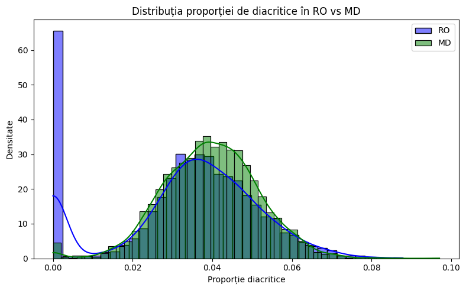
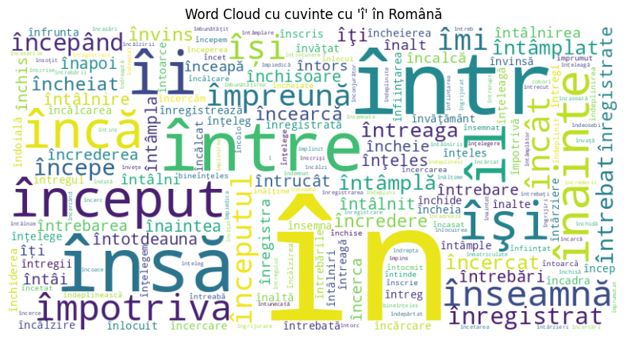
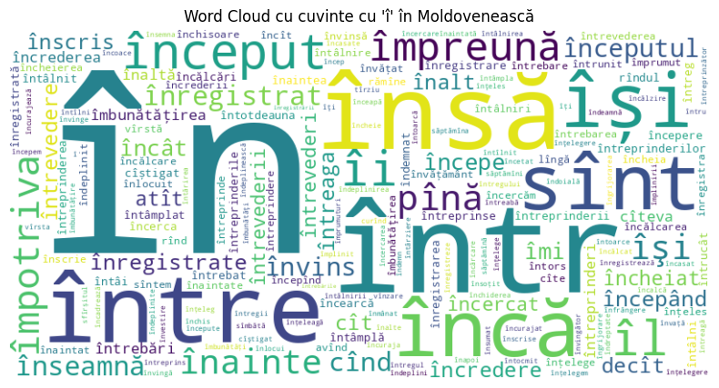
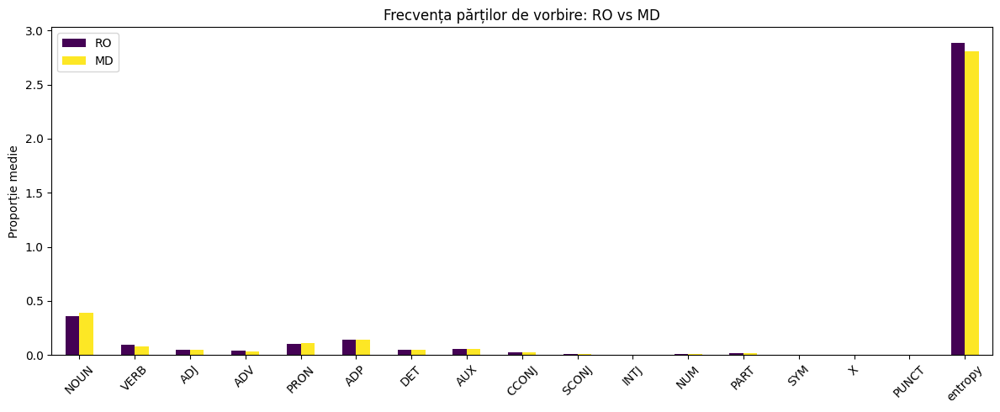
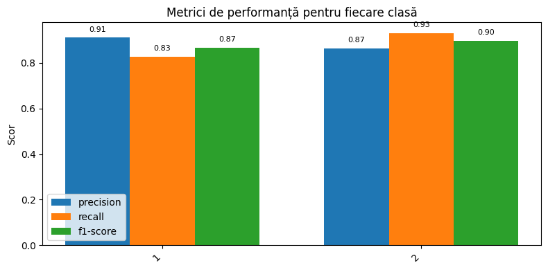
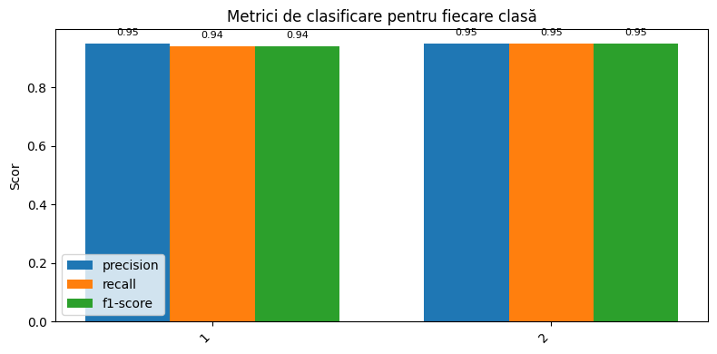

# Romanian vs Moldovan Dialect Classification

> **NitroNLP Project**: Automatic classification of Romanian Standard vs Moldovan dialect using machine learning and deep learning approaches.

##  Project Overview

This project explores the challenging task of distinguishing between **Romanian Standard** and **Moldovan dialect** using state-of-the-art NLP techniques. We combine traditional machine learning with modern transformer architectures to achieve high classification accuracy.

### Key Objectives
-  Automatically classify text samples as Romanian or Moldovan dialect
-  Analyze linguistic differences between the two variants
-  Compare classical ML vs deep learning approaches
-  Provide interpretable insights into discriminative features

##  Datasets

| Dataset | Purpose | Description |
|---------|---------|-------------|
| [MOROCO](https://github.com/butnaruandrei/MOROCO) | Primary | News corpus for Romanian & Moldovan dialects |
| [SlavicNER](https://github.com/BSoboleva/SlavicNER) | Comparative | Used for Russian similarity analysis |

##  Data Processing Pipeline

### 1. Preprocessing Steps
-  **Lowercasing** - Normalize text case
-  **Punctuation removal** - Clean special characters
-  **Number removal** - Remove numeric content
-  **Space normalization** - Handle extra whitespace
-  **NER preservation** - Keep named entity tokens intact

### 2. Dataset Splits
- **Training set**: Model training
- **Validation set**: Hyperparameter tuning
- **Test set**: Final evaluation

## 🔬 Linguistic Analysis

### Diacritics Distribution
Moldovan texts show distinctive patterns in diacritics usage:
- **Higher density** of î, ș, ț characters




- **î often used inside words** (vs Romanian preference for â)





### Part-of-Speech Patterns
Using Stanza for Romanian POS tagging revealed:
- **Romanian**: More verbs, higher POS variety
- **Moldovan**: More noun-heavy structures



### Russian Language Influence
Cosine similarity analysis with SlavicNER data:
- Romanian ↔ Moldovan: **0.99** (high similarity)
- Romanian ↔ Russian: **-0.0005** (minimal connection)
- Moldovan ↔ Russian: **+0.01** (slightly stronger Russian influence)

## 🤖 Classification Approaches

### 📊 Classical Machine Learning

**Features Engineering:**
```python
# TF-IDF Vectorization
X_valid_tfidf = vectorizer.transform(df_valid['clean_sample'])

# Linguistic Features
letter_features_valid = pd.DataFrame(
    df_valid['clean_sample'].apply(extract_letter_features).tolist()
)
diacritic_features_valid = pd.DataFrame(
    df_valid['clean_sample'].apply(extract_diacritic_features).tolist()
)

# POS Features
df_valid['pos_tags'] = df_valid['clean_sample'].progress_apply(get_pos_tags)
pos_features_valid = pd.DataFrame(
    df_valid['pos_tags'].progress_apply(extract_pos_features).tolist()
)

# Russian Similarity
df_valid['sim_rus'] = df_valid['clean_sample'].progress_apply(
    lambda x: compute_similarity_with_russian(x, fasttext_ro, mean_ru)
)
```

**Model Configuration:**
```python
rf_model = RandomForestClassifier(
    n_estimators=200, 
    max_depth=30, 
    random_state=42
)
rf_model.fit(X_train_combined, y_train)
```

**Feature Set:**
-  **TF-IDF**: Up to 15,000 n-grams (4-6 range)
-  **Diacritics frequency**: î, ș, ț usage patterns
-  **Letter ratios**: î/â and ă/a ratios
-  **POS tags**: Grammatical structure analysis

###  Deep Learning with Transformers

**Model Setup:**
```python
model_name = "readerbench/RoBERT-base"
tokenizer = AutoTokenizer.from_pretrained(model_name)
model = AutoModelForSequenceClassification.from_pretrained(
    model_name, 
    num_labels=3
)

# Tokenization
train_encodings = tokenizer(
    train_texts, 
    padding=True, 
    truncation=True, 
    max_length=128, 
    return_tensors="pt"
)
```

**Training Configuration:**
```python
training_args_dialect = TrainingArguments(
    output_dir="./results",
    per_device_train_batch_size=16,
    num_train_epochs=5,
    logging_strategy="epoch",
    load_best_model_at_end=False,
    metric_for_best_model="accuracy"
)
```

##  Results & Performance

### Model Comparison

| Model | Test Accuracy | Key Strengths | Limitations |
|-------|---------------|---------------|-------------|
| **Random Forest + Features** | **88.4%** | ✅ Interpretable<br/>✅ Feature importance<br/>✅ Fast training | ❌ Manual feature engineering<br/>❌ Misses subtle patterns |
| **Fine-tuned RoBERT** | **94.7%** | ✅ Superior performance<br/>✅ Automatic feature learning<br/>✅ Deep representations | ❌ Less interpretable<br/>❌ Computationally intensive |

### Performance Visualizations





### Classification Errors (Random Forest)
- **Moldovan misclassifications**: 219/2,472 samples (8.9%)
- **Romanian misclassifications**: 466/3,452 samples (13.5%)

### Top Discriminative Features


**Most Important Features:**
1.  **Diacritics**: ș and ț frequency
2.  **Vocabulary**: *moldovenesc* and derivatives  
3.  **Ratios**: î/â and ă/a character ratios
4.  **Grammar**: Noun frequency patterns


##  Key Insights

### Linguistic Discoveries
- **Diacritics usage** is a strong dialect indicator
- **î/â alternation** follows different patterns in each variant
- **Grammatical structures** show measurable differences
- **Russian influence** in Moldovan is subtle but detectable

### Technical Findings
- **Transformers** significantly outperform traditional ML (6.3% improvement)
- **Feature engineering** provides valuable interpretability
- **Ensemble approaches** could potentially combine both strengths

##  Future Directions

### Planned Improvements
- [ ] **Cross-lingual embeddings** for Romanian-Moldovan-Russian analysis
- [ ] **Explainable AI** methods (SHAP, LIME) for transformer interpretation
- [ ] **Ensemble models** combining interpretability with performance

### Research Extensions
- [ ] **Historical evolution** of dialect differences
- [ ] **Regional variations** within Moldova and Romania  
- [ ] **Social media** dialect patterns
