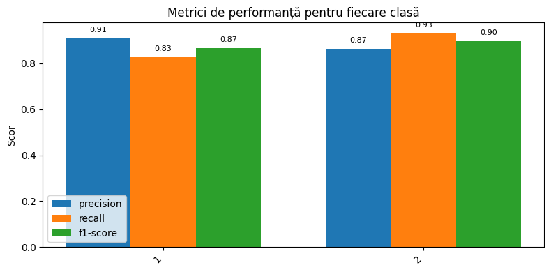

# Dialect Classification: Romanian vs Moldovan  

This project, developed within **NitroNLP**, explores the task of distinguishing between **Romanian Standard** and the **Moldovan dialect** using the **MOROCO corpus**. It combines **linguistic feature analysis** with **machine learning models** (Random Forest, TF-IDF) and **deep learning approaches** (fine-tuned RoBERTa for Romanian).  

## 📌 Project Overview  

- **Goal**: Automatically classify text samples as either Romanian or Moldovan dialect.  
- **Datasets**:  
  - [MOROCO](https://github.com/butnaruandrei/MOROCO) – news corpus for Romanian & Moldovan dialects.  
  - [SlavicNER](https://github.com/BSoboleva/SlavicNER) – used for comparative analysis with Russian texts.  

## ⚙️ Data Processing  

1. **Dataframes creation** – train, validation, and test splits.  
2. **Minimal preprocessing**:  
   - Lowercasing  
   - Removing punctuation, numbers, and extra spaces  
   - Preserving Named Entity tokens  
3. **Linguistic analysis**:  
   - **Diacritics frequency**: Moldovan shows higher density of **î, ș, ț**, with **î** often used inside words. 
    
   - **POS tagging** (using *Stanza* for Romanian):  
     - Romanian → more verbs, higher POS variety  
     - Moldovan → more nouns  
     
   - **Russian influence**: similarity scores (cosine similarity with SlavicNER data):  
     - Romanian ↔ Moldovan: **0.99**  
     - Romanian ↔ Russian: **-0.0005**  
     - Moldovan ↔ Russian: **+0.01** (slightly stronger connection than Romanian).  

## 🧪 Classification Approaches  

### 1. **Classical ML with Linguistic Features**  
- **Features**: TF-IDF (up to 15,000 n-grams, range 4–6), diacritics frequency, î/â ratio, POS tags. 

X_valid_tfidf = vectorizer.transform(df_valid['clean_sample'])

letter_features_valid = pd.DataFrame(
    df_valid['clean_sample'].apply(extract_letter_features).tolist()
)

diacritic_features_valid = pd.DataFrame(
    df_valid['clean_sample'].apply(extract_diacritic_features).tolist()
)

df_valid['pos_tags'] = df_valid['clean_sample'].progress_apply(get_pos_tags)

pos_features_valid = pd.DataFrame(
    df_valid['pos_tags'].progress_apply(extract_pos_features).tolist()
)

df_valid['sim_rus'] = df_valid['clean_sample'].progress_apply(
    lambda x: compute_similarity_with_russian(x, fasttext_ro, mean_ru)
)

sim_feat_valid = df_valid['sim_rus'].values.reshape(-1, 1)

X_valid_dense = np.hstack([
    letter_features_valid.values,
    diacritic_features_valid.values,
    pos_features_valid.values,
    sim_feat_valid
])

X_valid_combined = hstack([X_valid_tfidf, X_valid_dense])
y_valid = df_valid['label']

- **Model**: Random Forest. 

rf_model = RandomForestClassifier(n_estimators=200, max_depth=30, random_state=42)
rf_model.fit(X_train_combined, y_train)

- **Performance**:  
  - Validation accuracy: **88.3%**  
  - Test accuracy: **88.4%** 
    
  - Misclassifications:  
    - 219 / 2472 Moldovan samples  
    - 466 / 3452 Romanian samples  
- **Top discriminative features**:  
  - Frequency of **ș** and **ț**  
  - Words like *moldovenesc* and derivatives  
  - Ratios **î/â** and **ă/a**
    
   
  - POS tags (notably *noun*).  

### 2. **Deep Learning with Transformers**  
- **Model**: Fine-tuned *RoBERT* (Romanian pretrained transformer). 

model_name = "readerbench/RoBERT-base"
tokenizer = AutoTokenizer.from_pretrained(model_name)
model = AutoModelForSequenceClassification.from_pretrained(model_name, num_labels=3) 

- **Setup**:  
  - Tokenizer with max length 128  
  
train_encodings = tokenizer(
    train_texts, padding=True, truncation=True, max_length=128, return_tensors="pt"
)
  - CrossEntropyLoss  
  - Training: 5 epochs, batch size 16  

  training_args_dialect = TrainingArguments(
    output_dir="./results",
    per_device_train_batch_size=16,
    num_train_epochs=5,
    logging_dir="./logs",
    label_smoothing_factor=0.0,

    logging_strategy="epoch",
    logging_steps=100,
    report_to="none",
    load_best_model_at_end=False,
    metric_for_best_model="accuracy"
)
- **Performance**:  
  - Test accuracy: **94.7%**  
   
- **Insights**:  
  - Captures subtle linguistic traits without manual feature engineering  
  - Outperforms Random Forest by ~6%  

## 📊 Results Comparison  

| Model                  | Accuracy (Test) | Notes |
|------------------------|----------------|-------|
| Random Forest (TF-IDF + features) | 88.4% | More interpretable, highlights discriminative features |
| Fine-tuned RoBERT      | 94.7% | Less interpretable, but significantly better performance |

## ✅ Conclusions  

- **Random Forest + linguistic features**: offers interpretability, highlights discriminative linguistic markers, but misses subtle patterns.  
- **RoBERT transformer**: superior performance, learns deep language representations automatically, but harder to interpret.  
- **Overall**: Transformers are more effective for **dialect classification**, while classical ML aids **explainability**.  

## 🚀 Future Work  

- Extend analysis with **cross-lingual embeddings** (Romanian–Moldovan–Russian).  
- Apply **explainable AI (XAI)** methods (e.g., SHAP, LIME) to interpret RoBERT predictions.
  
---

🔬 *This project was developed as part of NitroNLP, focusing on the intersection of linguistic analysis and machine learning for dialect classification.*  
